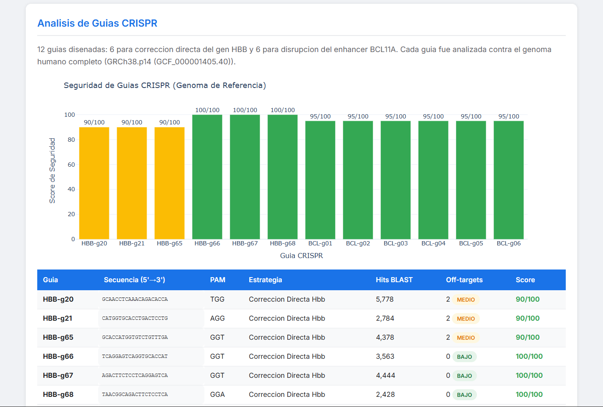
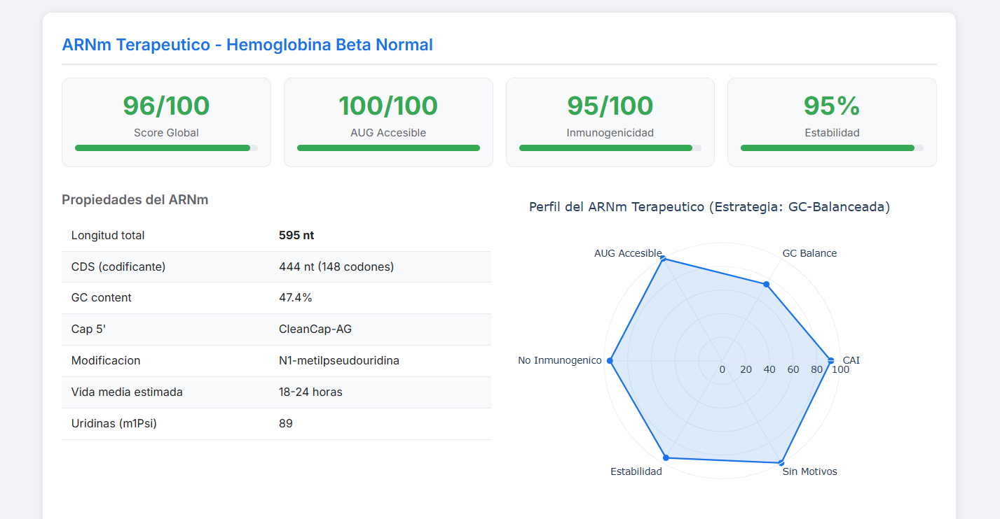

# 🧬 EXONIK
### Personalized Gene Therapy Design Platform

> *"The same CRISPR guide safe for one patient can be dangerous for another — because their genomes are different."*

[](https://python.org)
[](LICENSE)
[](https://github.com)
[](https://github.com)

<p align="center">
  
</p>

<p align="center"><em>Left: HBB protein with 8 alpha helices colored — Right: GPS CRISPR showing exactly where guide HBB-g68 cuts at GLU-7 (the SCA mutation site)</em></p>

---

## ⚡ The Problem

**Sickle Cell Disease (SCD)** affects ~300,000 newborns each year and ~20+ million people worldwide. It is caused by a single nucleotide mutation in the *HBB* gene:

```
Gene:      HBB (Beta-Hemoglobin) — Chromosome 11
Mutation:  c.20A>T  |  rs334
Codon:     GAG → GTG
Protein:   Glutamic Acid → Valine (position 7)
Result:    HbS hemoglobin → sickle-shaped red blood cells
```

Current gene therapies (including **Casgevy**, the first FDA-approved CRISPR therapy in 2023) use a **one-size-fits-all** approach: the same guide RNA for every patient.

**But every human genome is unique.**

A patient's individual genetic variants (SNPs) can:
- ✅ **Eliminate** a dangerous off-target (natural protection)
- ❌ **Create** a new off-target that doesn't exist in the reference genome (hidden risk)

Nobody is doing this at scale yet. **That is Exonik's opportunity.**

---


## 🧠 Why Not Just Discover Better Drugs?

**Google DeepMind's Isomorphic Labs** is applying AlphaFold and generative AI to revolutionize **drug discovery** — designing small molecules that bind to protein targets. Their framework is impressive:

```
Isomorphic Labs (DeepMind):
  Protein Structure (AlphaFold) → Drug Target → Small Molecule Design → Clinical Trials
  
  = Find the broken protein, design a molecule that patches it
```

**But Exonik takes a fundamentally different approach:**

```
EXONIK:
  Patient Genome → Mutation Identified → CRISPR Guide → mRNA Therapy → Gene Corrected
  
  = Find the broken DNA, fix the code that builds the protein
```

| | Isomorphic Labs (Drug Discovery) | **EXONIK (Gene Therapy)** |
|---|---|---|
| **Target** | Protein surface (downstream) | DNA sequence (upstream) |
| **Action** | Design molecule to bind/block protein | Edit genome to fix the root mutation |
| **Duration** | Chronic (patient takes drug repeatedly) | **One-time correction** |
| **Personalization** | Same drug for all patients | **Each patient's genome analyzed** |
| **Analogy** | Patching a bug at runtime | **Fixing the source code** |

Both approaches use AI + structural biology. But while drug discovery treats the **symptom** (a misfolded protein), gene therapy fixes the **cause** (a mutated nucleotide). Exonik operates at the most upstream point possible — **the genome itself**.

> *"The best way to fix a bug is not to write a better error handler — it's to fix the line of code that causes it."*

---

## 💡 What is EXONIK?

EXONIK is a computational pipeline that designs **patient-personalized gene therapies** from raw genomic data to clinical report — fully automated.

It combines:
- **CRISPR/Cas9 guide design** with real off-target analysis against the full human genome (GRCh38)
- **Patient-level personalization** — each patient's SNPs are crossed against every off-target
- **Therapeutic mRNA design** — codon optimization, secondary structure prediction, immunogenicity screening
- **AlphaFold 3D visualization** — protein structure analysis with CRISPR GPS mapping
- **Interactive clinical dashboard** — ready for presentation to clinicians or investors

---

---

## 📊 Key Results

| Metric | Result |
|--------|--------|
| Real patients analyzed | **5** (Nigeria, Gambia, Colombia, Puerto Rico, Caribbean) |
| CRISPR guides designed | **12** (6 HBB + 6 BCL11A strategies) |
| Off-targets found (real BLAST) | **12** (chr2, chr11, chr14) |
| Personalization coverage | **12/12 off-targets × 5 patients** |
| Best guide | **HBB-g68** (safety: 100/100, 0 off-targets) |
| Therapeutic mRNA score | **96/100** |
| AUG accessibility | **100/100** |
| Immunogenicity risk | **VERY LOW** (endogenous protein) |
| 3D visualizations | **4 interactive HTML** + 3 static diagrams |

---

## 🖥️ Dashboard Preview

> Open `reporte_integrado/dashboard_exonik.html` in any browser — no server required.

<p align="center">
  
</p>

<p align="center"><em>12 CRISPR guides analyzed against the full human genome — HBB-g66, g67, g68 achieve perfect 100/100 safety scores with zero off-targets</em></p>

<p align="center">
  
</p>

<p align="center"><em>Therapeutic mRNA scored 96/100 — codon-optimized, AUG-accessible (100/100), low immunogenicity, modified with N1-methylpseudouridine</em></p>

The dashboard includes:
- **CRISPR Safety Profile** — safety scores for all 12 guides
- **Genomic Off-Target Map** — scatter plot across chromosomes 2, 11, 14
- **Patient × Guide Heatmap** — personalized safety matrix
- **mRNA Radar Chart** — multidimensional quality profile
- **GC Content Window Analysis** — stability across the CDS
- **Optimization Strategy Comparison** — CAI vs GC balance

📁 See `reporte_integrado/reporte_clinico_HG01889.html` for a sample clinical report (anonymized patient, Afro-Caribbean cohort).

---

## 🧬 3D Protein Visualizations (Phase 6)

All 3D visualizations are **interactive HTML files** — open them in any browser to rotate, zoom, and explore the protein from every angle.

### GPS CRISPR — Where Exactly Does the Guide Cut?

The best CRISPR guide (**HBB-g68**) was mapped from DNA coordinates to 3D protein structure:

```
Guide RNA:     5'-TAACGGCAGACTTCTCCTCA-3'  (antisense)
PAM:           GGA
CDS positions: 17 → 36  (20 nt)
Protein zone:  amino acids 6 → 12
Cas9 cut site: inside codon 7 = GLU-7 = rs334 mutation
Safety score:  100/100  |  Off-targets: 0
```

**The guide cuts at the exact amino acid that causes the disease.**

| Visualization | File | Description |
|---|---|---|
|   HBB Spectrum | `estructuras_3d/HBB_3d_espectro.html` | Full protein colored N→C terminal |
|   Mutation Site | `estructuras_3d/HBB_3d_mutacion.html` | GLU-7 highlighted in Helix A |
|   8 Alpha Helices | `estructuras_3d/HBB_3d_helices.html` | All helices A-H color-coded |
|   GPS CRISPR | `estructuras_3d/GPS_CRISPR_3d.html` | **HBB-g68 target zone on 3D protein** |

> 💡 **How to view**: Download the HTML file and open it in Chrome/Edge/Firefox. Click+drag to rotate, scroll to zoom.

### Static Diagrams & Screenshots

| Image | Description |
|---|---|
| `screenshots/HBB_VS_Crispr.png` | 3D comparison: full protein helices vs CRISPR GPS zone |
| `screenshots/Guia_CRISPR_Dashboard.png` | Dashboard: CRISPR guide safety analysis (12 guides) |
| `screenshots/ARNm_Dashboard.png` | Dashboard: therapeutic mRNA design (score 96/100) |
| `screenshots/GPS_CRISPR_HBB-g68.png` | DNA→Protein mapping of the CRISPR guide |
| `screenshots/HBB-SCA.png` | Sickle Cell mutation visualization |
| `screenshots/pLDDT_HBB.png` | B-factor profile showing protein rigidity |
| `screenshots/mecanismo_molecular_SCA.png` | Molecular mechanism: GLU→VAL polymerization |

---

## 🛠️ Technology Stack

| Tool | Version | Purpose |
|------|---------|---------|
| **Python** | 3.10+ | Core pipeline language |
| **BLAST+** | 2.17.0 | Off-target search against full genome |
| **seqfold** | latest | mRNA secondary structure (thermodynamic) |
| **pyliftover** | latest | GRCh38 ↔ GRCh37 coordinate conversion |
| **plotly** | 5.x | Interactive clinical dashboard |
| **py3Dmol** | 2.x | Interactive 3D protein visualization |
| **BioPython** | 1.8x | PDB file parsing and analysis |
| **AlphaFold DB / RCSB PDB** | — | Protein 3D structures |
| **1000 Genomes Project** | Phase 3 | Real genomic variants from 2,504 people |
| **GRCh38.p14** | NCBI | Human reference genome (3.1 GB) |

---

```
reporte_integrado/dashboard_exonik.html  ← Open in Chrome / Edge / Firefox
estructuras_3d/GPS_CRISPR_3d.html        ← Interactive 3D CRISPR GPS
```

---

## 📁 Repository Structure (Public)

```
exonik/
├── config.py                    ← Central config: sequences, codon tables, guides
├── fase_01_genomas_reales.py    ← Phase 1: Download & parse 1000 Genomes data
├── fase_05_reporte_integrado.py ← Phase 5: Generate dashboard & clinical reports
├── requirements.txt             ← Python dependencies
├── README.md                    ← This file
│
├── reporte_integrado/           ← DEMO OUTPUTS (open in browser)
│   ├── dashboard_exonik.html        ← Main interactive dashboard (6 Plotly graphs)
│   ├── resumen_ejecutivo.html       ← Executive summary for stakeholders
│   └── reporte_clinico_HG01889.html ← Sample clinical report (1 anonymized patient)
│
├── estructuras_3d/              ← 3D INTERACTIVE VISUALIZATIONS
│   ├── HBB_3d_espectro.html         ← Full protein colored N→C terminal
│   ├── HBB_3d_mutacion.html         ← Mutation site GLU-7 highlighted
│   ├── HBB_3d_helices.html          ← 8 alpha helices color-coded
│   └── GPS_CRISPR_3d.html           ← CRISPR guide HBB-g68 mapped to 3D protein
│
└── screenshots/                 ← STATIC DIAGRAMS & SCREENSHOTS
    ├── HBB_VS_Crispr.png            ← 3D: full protein helices vs CRISPR GPS
    ├── Guia_CRISPR_Dashboard.png    ← Dashboard: 12 CRISPR guides analysis
    ├── ARNm_Dashboard.png           ← Dashboard: mRNA therapeutic design
    ├── GPS_CRISPR_HBB-g68.png       ← DNA→Protein mapping of the guide
    ├── HBB-SCA.png                  ← Sickle Cell mutation visualization
    ├── pLDDT_HBB.png                ← B-factor / rigidity profile
    └── mecanismo_molecular_SCA.png  ← Molecular mechanism: GLU→VAL polymerization
```

> **Note:** Phases 2, 3, and 4 contain proprietary algorithms (core IP) and are available to research partners and collaborators under NDA.

---

## 🎯 The Full Circle

This is what makes Exonik different — every phase connects to the next:

```
Phase 1 → Real genomes from 5 patients across 3 continents
    ↓
Phase 2 → HBB-g68 identified: safety score 100/100, zero off-targets
    ↓
Phase 3 → Each patient's SNPs cross-checked against all 12 off-targets
    ↓
Phase 4 → Therapeutic mRNA designed to deliver corrected HBB protein
    ↓
Phase 5 → Clinical dashboard ready for presentation
    ↓
Phase 6 → "And HERE, at atom 1383 of the PDB, at amino acid GLU-7,
           is exactly where the guide HBB-g68 cuts the DNA
           to fix the mutation that causes Sickle Cell Disease."
```

**From genome to atom. From data to therapy. {Personalized Medicine}.**

---

## ⚖️ Legal & Ethics

> **Research Use Only (RUO)**
> This software is intended for research and educational purposes only.
> It is NOT approved for clinical use, diagnosis, or treatment.
> All patient identifiers are derived from public research cohorts (1000 Genomes Project)
> and are used in accordance with their open data access policy.
> Any application of these results to real patients requires independent laboratory
> validation and regulatory approval.

---

## 👤 Author — Richard Garcia Vizcaino

*Casgevy cures sickle cell anemia, but costs $2.2 million. Our AI platform can reduce design time from months to hours, potentially lowering costs and making it accessible to the 20 million patients who need it..*

**Exonik** — Personalized Gene Therapy Design Platform
Built with Python, BLAST+, AlphaFold, real genomic data, and a lot of curiosity about programming cells.

---


*Version: 0.1.0 (Prototype) | Last updated: February 2026*

