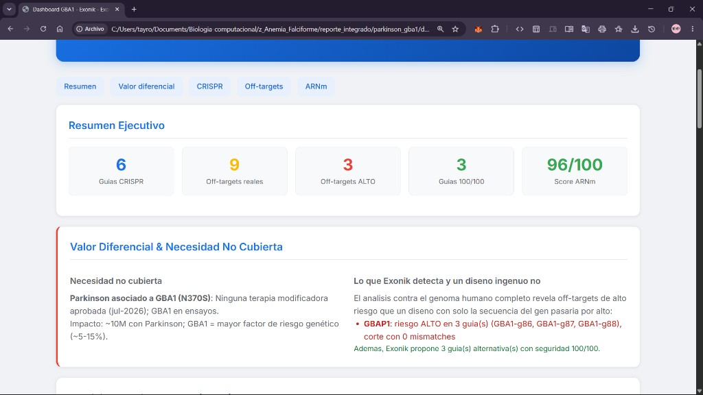
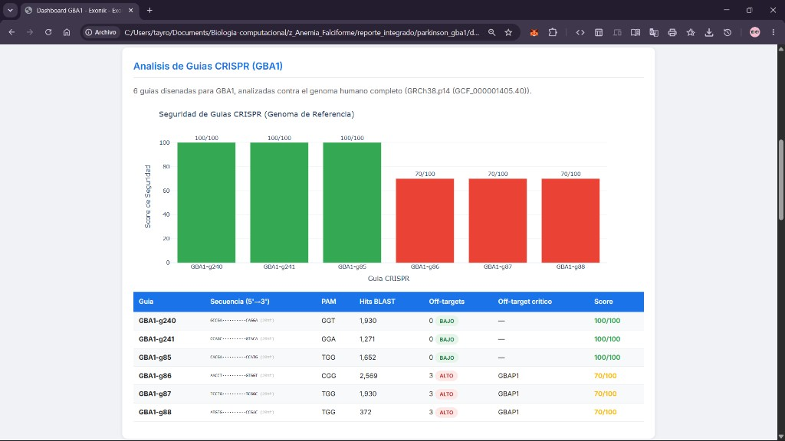
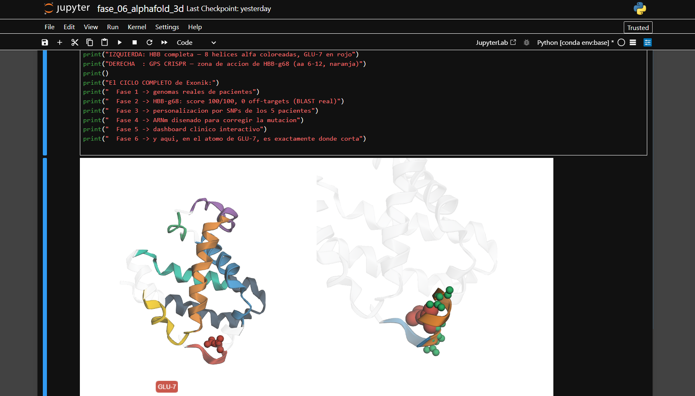

# 🧬 EXONIK
### Precision & Personalized Gene Therapy Design Platform

> *"The same CRISPR guide safe for one patient can be dangerous for another — because their genomes are different."*

[](https://python.org)
[](LICENSE)
[](https://github.com)
[](https://github.com)
[-purple)](https://github.com)

<p align="center">
  
</p>

<p align="center"><em>Flagship case — Parkinson's disease (GBA1 / N370S): 6 CRISPR guides analyzed against the full human genome, revealing 3 HIGH-risk off-targets hidden inside the <strong>GBAP1 pseudogene</strong> — the exact risk a naive, gene-only design would miss. Therapeutic mRNA scored 96/100.</em></p>

---

## ⚡ The Problem — An Unmet Need

**Parkinson's disease** affects ~10 million people worldwide, and — as of **July 2026** — there is **no approved disease-modifying therapy**. Every treatment on the market only manages symptoms; none corrects the underlying biology.

The single **largest genetic risk factor** for Parkinson's is the ***GBA1*** gene (glucocerebrosidase / GCasa), implicated in **~5–15%** of cases:

```
Gene:      GBA1 (Glucocerebrosidase / GCasa) — Chromosome 1
Variant:   c.1226A>G  |  rs76763715  |  N370S (p.Asn409Ser)
Codon:     AAC → AGC
Protein:   Asparagine → Serine  → reduced lysosomal GCasa activity
Result:    Glucosylceramide accumulation → elevated Parkinson's risk
Status:    NO approved disease-modifying therapy (Jul 2026); GBA1 approaches in trials
```

### 🎯 The technical hook: the GBAP1 pseudogene

*GBA1* sits ~16 kb away from a **pseudogene, GBAP1, with ~96% sequence identity**. Any CRISPR guide designed for *GBA1* looks almost identical to regions of *GBAP1* — a natural **minefield of near-identical off-targets**. A guide that appears "clean" against the gene alone can, in reality, cut the pseudogene.

**This is exactly where Exonik's engine — real off-target analysis against the whole genome, plus patient-level SNP personalization — delivers its differential value.**

> Sickle Cell Disease (SCD) is not forgotten — it remains Exonik's **fully validated baseline** (see below). But Parkinson-GBA1 is where the platform proves it can attack a high-impact disease with *no approved cure* and *genetically hostile* terrain.

---

## 🔬 The Differentiator — What Exonik Sees That Others Don't

A conventional "design a guide on the gene sequence" approach would ship guides `GBA1-g86/g87/g88` as reasonable candidates. Exonik ran each guide against the **entire GRCh38 reference genome** and found the hidden danger:

```
Guide GBA1-g86 / g87 / g88:
   ON-target:   chr1:155,235,xxx  (GBA1) ✅  0 mismatches
   OFF-target:  chr1:155,215,xxx  (GBAP1 pseudogene) ⚠️ HIGH RISK — 0 mismatches!
   → A perfect-match cut in the WRONG place.

Guide GBA1-g240 / g85 / g241:
   ON-target only. 0 off-targets. Safety score 100/100 ✅
```

<p align="center">
  
</p>

<p align="center"><em>3 guides flagged HIGH-risk (perfect-match cut inside GBAP1) — and Exonik proposes 3 alternative guides with 100/100 safety. This is the difference between a therapy and an accident.</em></p>

**Nobody is doing genome-wide, patient-personalized off-target screening at scale for these targets. That is Exonik's opportunity.**

---

## 🧩 One Engine, Many Diseases — The Modular Platform

Exonik is **disease-agnostic by design**. The core logic (CRISPR design, off-target BLAST, mRNA design, dashboards) is shared; each disease is a self-contained module (`diseases/<name>.py`) defined by a standard `Disease` schema. Switching targets is a single environment variable:

```bash
# Run the whole pipeline for a different disease — same engine, no code changes
export EXONIK_DISEASE=parkinson_gba1   # or: sca | beta_thal
```

| Disease | Gene | Variant | Role in Exonik |
|---|---|---|---|
| **Parkinson (GBA1)** | GBA1 | N370S · rs76763715 | ⭐ **Flagship** — unmet need + GBAP1 differentiator |
| **Sickle Cell Disease** | HBB | rs334 · GAG→GTG | ✅ **Validated baseline** — 5 real patients, full personalization |
| **Beta-Thalassemia** | HBB | (β⁺/β⁰) | 🧩 **Proof of modularity** — same gene, different variant |

> The same platform that was fully validated end-to-end on Sickle Cell was **redirected to Parkinson-GBA1 by configuration alone** — the strongest possible evidence that Exonik scales across monogenic and genetically complex targets.

---

## 🧠 Why Not Just Discover Better Drugs?

**Google DeepMind's Isomorphic Labs** is applying AlphaFold and generative AI to revolutionize **drug discovery** — designing small molecules that bind to protein targets. Their framework is impressive:

```
Isomorphic Labs (DeepMind):
  Protein Structure (AlphaFold) → Drug Target → Small Molecule Design → Clinical Trials

  = Find the broken protein, design a molecule that patches it
```

**But Exonik takes a fundamentally different approach:**

```
EXONIK:
  Patient Genome → Mutation Identified → CRISPR Guide → mRNA Therapy → Gene Corrected/Restored

  = Find the broken DNA, fix (or restore) the code that builds the protein
```

| | Isomorphic Labs (Drug Discovery) | **EXONIK (Gene Therapy)** |
|---|---|---|
| **Target** | Protein surface (downstream) | DNA / mRNA (upstream) |
| **Action** | Design molecule to bind/block protein | Edit genome / restore the missing protein |
| **Duration** | Chronic (patient takes drug repeatedly) | **One-time correction / durable restoration** |
| **Personalization** | Same drug for all patients | **Each patient's genome analyzed** |
| **Analogy** | Patching a bug at runtime | **Fixing the source code** |

Both approaches use AI + structural biology. But while drug discovery treats the **symptom** (a misfolded protein), gene therapy fixes the **cause** (a mutated or deficient gene). Exonik operates at the most upstream point possible — **the genome itself**.

> *"The best way to fix a bug is not to write a better error handler — it's to fix the line of code that causes it."*

---

## 💡 What is EXONIK?

EXONIK is a computational pipeline that designs **precision, patient-personalizable gene therapies** — from raw genomic data to clinical report — fully automated.

It combines:
- **CRISPR/Cas9 guide design** with real off-target analysis against the full human genome (GRCh38)
- **Genome-wide safety screening** that catches near-identical off-targets (e.g. the *GBAP1* pseudogene)
- **Patient-level personalization** — each patient's SNPs crossed against every off-target *(validated on SCA; roadmap for Parkinson)*
- **Therapeutic mRNA design** — codon optimization, secondary structure prediction, immunogenicity screening
- **AlphaFold 3D visualization** — protein structure analysis with CRISPR GPS mapping
- **Interactive clinical dashboard** — ready for presentation to clinicians or investors

**Two layers of intelligence:** *precision at the variant* (design for the disease-causing mutation) + *personalization at the patient* (adapt to each individual genome).

---

## 📊 Key Results

### ⭐ Flagship — Parkinson's Disease (GBA1)

| Metric | Result |
|--------|--------|
| Target gene | **GBA1** (chr1) — N370S / rs76763715 |
| Approved disease-modifying therapy | **None** (as of Jul 2026) |
| CRISPR guides designed | **6** (analyzed vs full GRCh38 genome) |
| Guides with perfect safety | **3** (GBA1-g240, g85, g241) — **0 off-targets, 100/100** |
| HIGH-risk off-targets detected | **3** — all inside the ***GBAP1* pseudogene** (0-mismatch cuts) |
| Pseudogene challenge | GBAP1 ~96% identity, ~16 kb from GBA1 |
| Therapeutic mRNA score | **96/100** (functional GCasa, 536 aa) |
| AUG accessibility | **100/100** |
| Immunogenicity risk | **VERY LOW** (95/100 — endogenous protein) |
| Suggested delivery | LNP → IV, blood-brain-barrier-crossing ligands |

### ✅ Validated Baseline — Sickle Cell Disease (HBB)

| Metric | Result |
|--------|--------|
| Real patients analyzed | **5** (Nigeria, Gambia, Colombia, Puerto Rico, Caribbean) |
| CRISPR guides designed | **12** (6 HBB + 6 BCL11A strategies) |
| Off-targets found (real BLAST) | **12** (chr2, chr11, chr14) |
| Personalization coverage | **12/12 off-targets × 5 patients** |
| Best guide | **HBB-g68** (safety: 100/100, 0 off-targets) |
| Therapeutic mRNA score | **96/100** |
| 3D visualizations | **4 interactive HTML** + 3 static diagrams |

---

## 🖥️ Dashboard Preview

> Open `reporte_integrado/parkinson_gba1/dashboard_exonik.html` in any browser — no server required.

<p align="center">
  
</p>

<p align="center"><em>Executive summary + the unmet-need / differential-value narrative: 6 guides, 9 real off-targets, 3 HIGH-risk (GBAP1), 3 perfect guides, mRNA 96/100.</em></p>

<p align="center">
  
</p>

<p align="center"><em>Per-guide safety scores and the exact GBAP1 off-targets — green guides are ready, red guides are the ones a gene-only design would have shipped by mistake.</em></p>

The flagship dashboard includes:
- **Executive Summary** — headline metrics at a glance
- **Differential Value & Unmet Need** — why this matters and what Exonik uniquely detects
- **CRISPR Safety Profile** — safety scores for all guides (GBA1 vs GBAP1)
- **Genomic Off-Target Map** — where each hit lands in the genome
- **mRNA Design** — multidimensional therapeutic quality profile

> The Sickle Cell dashboard (`reporte_integrado/dashboard_exonik.html`) adds a **Patient × Guide personalization heatmap** across the 5-patient cohort — the personalization layer that is on the roadmap for Parkinson.

---

## 🧬 3D Protein Visualizations (Phase 6)

Exonik maps CRISPR guides from DNA coordinates all the way to the **3D protein structure** (AlphaFold / RCSB PDB) — visualizing *exactly where* the guide acts on the protein. This capability is fully demonstrated on **Sickle Cell (HBB)**:

<p align="center">
  
</p>

<p align="center"><em>Left: HBB protein with 8 alpha helices colored — Right: GPS CRISPR showing exactly where guide HBB-g68 cuts at GLU-7 (the SCA mutation site).</em></p>

```
Guide RNA:     5'-TAACGGCAGACTTCTCCTCA-3'  (antisense)
CDS positions: 17 → 36 (20 nt)  |  Protein zone: amino acids 6 → 12
Cas9 cut site: inside codon 7 = GLU-7 = rs334 mutation
Safety score:  100/100  |  Off-targets: 0
```

| Visualization | File | Description |
|---|---|---|
| HBB Spectrum | `estructuras_3d/HBB_3d_espectro.html` | Full protein colored N→C terminal |
| Mutation Site | `estructuras_3d/HBB_3d_mutacion.html` | GLU-7 highlighted in Helix A |
| 8 Alpha Helices | `estructuras_3d/HBB_3d_helices.html` | All helices A–H color-coded |
| GPS CRISPR | `estructuras_3d/GPS_CRISPR_3d.html` | HBB-g68 target zone on 3D protein |

> 🗺️ **Roadmap — GBA1 3D:** The same GPS-CRISPR view for **GCasa (GBA1, UniProt P04062)** with the N370S site highlighted is the next visualization. Because 3D operates at the *protein* level (not patient data), it applies directly to Parkinson.

---

## 🛠️ Technology Stack

| Tool | Version | Purpose |
|------|---------|---------|
| **Python** | 3.10+ | Core pipeline language |
| **BLAST+** | 2.17.0 | Off-target search against full genome |
| **seqfold** | latest | mRNA secondary structure (thermodynamic) |
| **pyliftover** | latest | GRCh38 ↔ GRCh37 coordinate conversion |
| **plotly** | 5.x | Interactive clinical dashboard |
| **py3Dmol** | 2.x | Interactive 3D protein visualization |
| **BioPython** | 1.8x | PDB file parsing and analysis |
| **AlphaFold DB / RCSB PDB** | — | Protein 3D structures |
| **1000 Genomes Project** | Phase 3 | Real genomic variants from 2,504 people |
| **GRCh38.p14** | NCBI | Human reference genome (~3.1 GB) |

---

## 📁 Repository Structure (Public)

```
exonik/
├── config.py                     ← Dynamic disease loader (EXONIK_DISEASE)
├── fase_01_genomas_reales.py     ← Phase 1: Download & parse 1000 Genomes data
├── fase_05_reporte_integrado.py  ← Phase 5: Generate dashboards & clinical reports
├── requirements.txt              ← Python dependencies
├── README.md                     ← This file
│
├── diseases/                     ← MODULAR DISEASE DEFINITIONS (public reference data)
│   ├── base.py                       ← `Disease` dataclass — the shared schema
│   ├── sca.py                        ← Sickle Cell (HBB) — validated baseline
│   ├── beta_thal.py                  ← Beta-Thalassemia (HBB) — modularity proof
│   └── parkinson_gba1.py             ← Parkinson (GBA1) — flagship
│
├── reporte_integrado/            ← DEMO OUTPUTS (open in browser)
│   ├── dashboard_exonik.html            ← SCA dashboard (personalization heatmap)
│   ├── reporte_clinico_HG01889.html     ← SCA sample clinical report
│   └── parkinson_gba1/
│       └── dashboard_exonik.html        ← Parkinson flagship dashboard
│
├── estructuras_3d/               ← 3D INTERACTIVE VISUALIZATIONS (HBB)
│   ├── HBB_3d_espectro.html / _mutacion.html / _helices.html
│   └── GPS_CRISPR_3d.html               ← CRISPR guide mapped to 3D protein
│
└── screenshots/                  ← STATIC DIAGRAMS & SCREENSHOTS
    ├── Parkinson_Dashboard_Resumen.png  ← Flagship: summary + differential value
    ├── Parkinson_Dashboard_CRISPR.png   ← Flagship: GBA1 vs GBAP1 guide safety
    ├── HBB_VS_Crispr.png                ← SCA 3D: protein helices vs CRISPR GPS
    ├── Guia_CRISPR_Dashboard.png        ← SCA dashboard: 12 CRISPR guides
    └── ARNm_Dashboard.png               ← SCA dashboard: mRNA therapeutic design
```

> **Note:** Phases 2, 3, 4 and the 3D notebook (Phase 6) contain proprietary algorithms (core IP) and are available to research partners and collaborators under NDA. The `diseases/` modules contain only **public reference sequences** (NCBI / dbSNP) and the modular architecture — intentionally shown to demonstrate the platform design.

---

## 🎯 The Full Circle — Parkinson (GBA1)

```
Phase 2 → 6 CRISPR guides designed on GBA1; each BLASTed vs the full GRCh38 genome
    ↓
         → 3 guides score 100/100 (zero off-targets) — clinically usable
         → 3 guides flagged: HIGH-risk 0-mismatch cut inside the GBAP1 pseudogene
    ↓
Phase 4 → Therapeutic mRNA for functional GCasa designed (96/100), LNP + BBB delivery
    ↓
Phase 5 → Flagship dashboard: unmet need + GBAP1 differentiator + mRNA evidence
    ↓
Phase 3 (roadmap) → Cross the GBAP1 off-targets with each patient's real SNPs
                    → "Is this guide safe for THIS patient's genome?"
```

**From genome to atom. From data to therapy. Precision at the variant — personalization at the patient.**

---

## ⚖️ Legal & Ethics

> **Research Use Only (RUO)**
> This software is intended for research and educational purposes only.
> It is NOT approved for clinical use, diagnosis, or treatment.
> All patient identifiers are derived from public research cohorts (1000 Genomes Project)
> and are used in accordance with their open data access policy.
> Reference sequences for all disease modules are public (NCBI / dbSNP).
> Any application of these results to real patients requires independent laboratory
> validation and regulatory approval.

---

## 👤 Author — Richard Garcia Vizcaino

*Parkinson's disease affects ~10 million people and still has no approved disease-modifying therapy. Exonik is a computational engine that designs precision, personalizable gene therapies — reducing design time from months to hours — and, critically, catches the hidden risks (like the GBAP1 pseudogene) that a gene-only approach would miss. Validated end-to-end on Sickle Cell, redirected to Parkinson by configuration alone.*

**Exonik** — Precision & Personalized Gene Therapy Design Platform
Built with Python, BLAST+, AlphaFold, real genomic data, and a lot of curiosity about programming cells.

---

*Version: 0.2.0 (Prototype — Modular Platform) | Last updated: July 2026*
